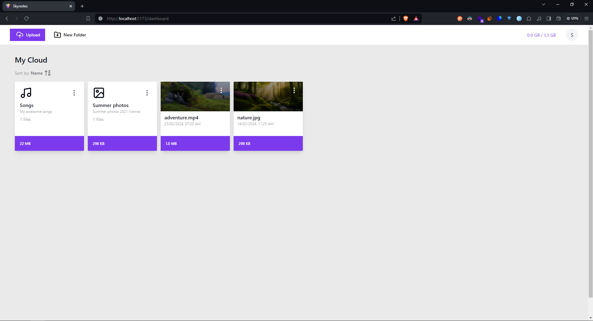
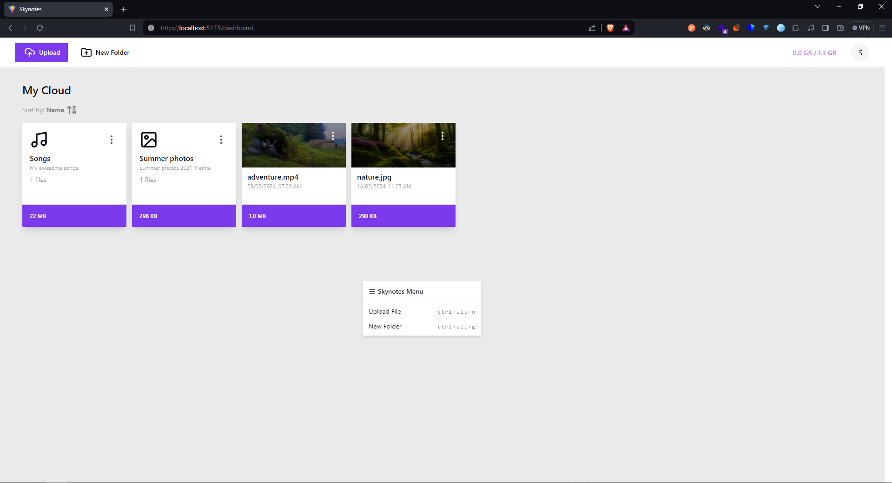
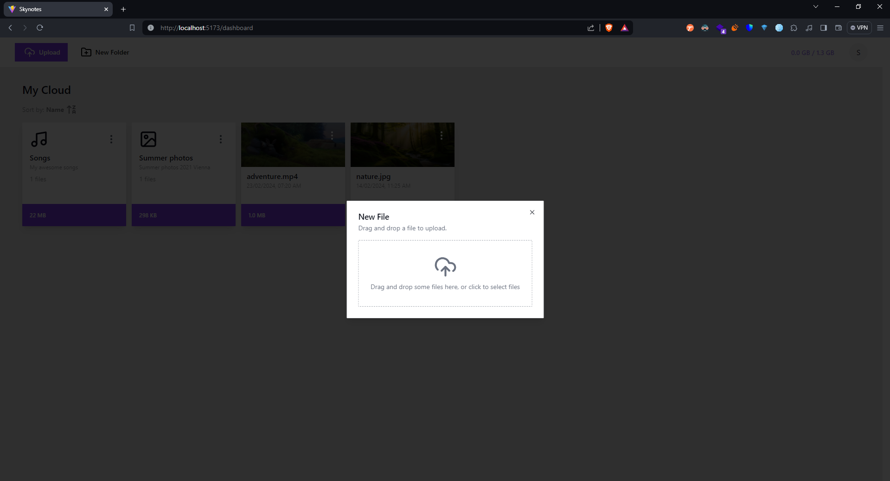
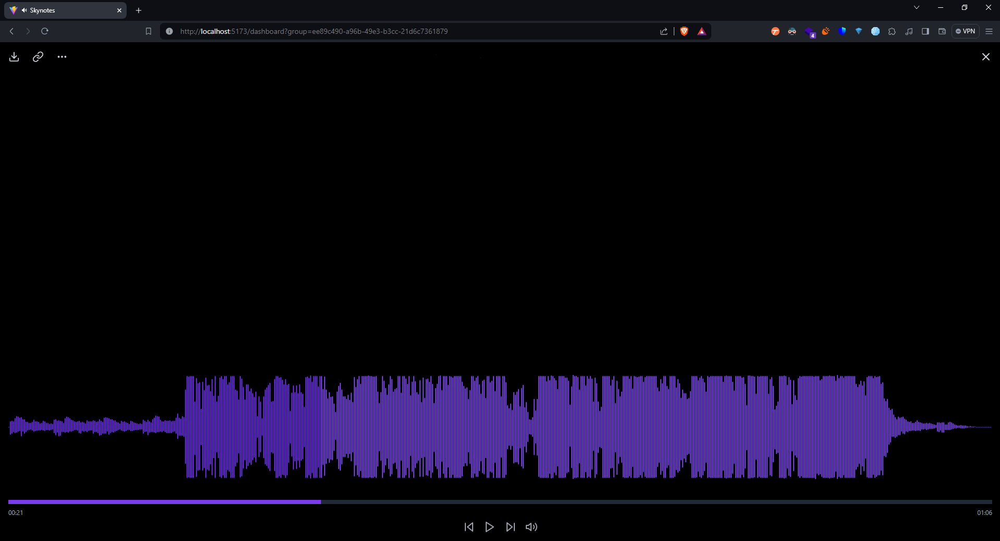
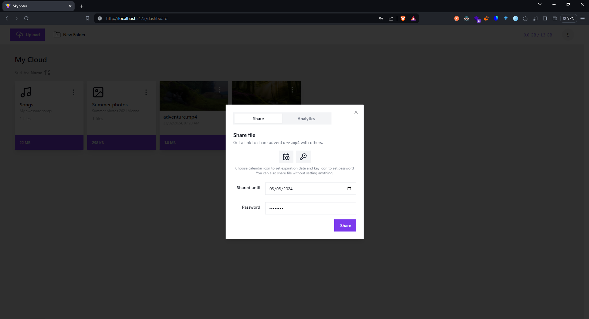
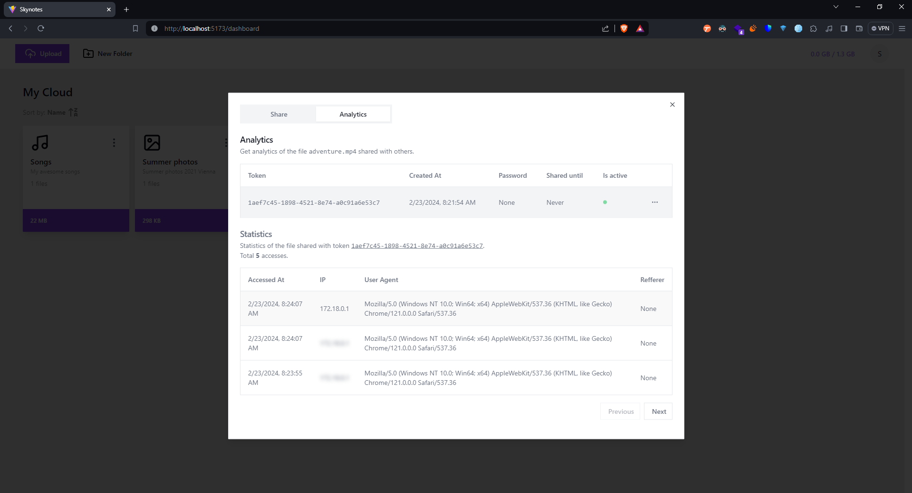

<a name="readme-top"></a>

[![Contributors][contributors-shield]][contributors-url]
[![Forks][forks-shield]][forks-url]
[![Stargazers][stars-shield]][stars-url]
[![Issues][issues-shield]][issues-url]
[![MIT License][license-shield]][license-url]

<!-- PROJECT LOGO -->
<br />
<div align="center">
  <h3 align="center">SkyNotes</h3>

  <p align="center">
    Lite cloud file storage
    <br />
    <a href="https://github.com/style77/skynotes/images">View Images</a>
    ·
    <a href="https://github.com/style77/skynotes/issues">Report Bug</a>
    ·
    <a href="https://github.com/style77/skynotes/issues">Request Feature</a>
  </p>
</div>


<!-- TABLE OF CONTENTS -->
<details>
  <summary>Table of Contents</summary>
  <ol>
    <li>
      <a href="#about-the-project">About The Project</a>
      <ul>
        <li><a href="#built-with">Built With</a></li>
      </ul>
    </li>
    <li>
      <a href="#getting-started">Getting Started</a>
      <ul>
        <li><a href="#prerequisites">Prerequisites</a></li>
        <li><a href="#installation-with-docker">Installation</a></li>
      </ul>
    </li>
    <li><a href="#contributing">Contributing</a></li>
    <li><a href="#license">License</a></li>
    <li><a href="#contact">Contact</a></li>
    <li><a href="#images">Images</a></li>
  </ol>
</details>


<!-- ABOUT THE PROJECT -->
## About The Project

[![Product Name Screen Shot][product-screenshot]](https://example.com)

SkyNotes is a simple cloud file storage. It is a project that I have been working on for a while. It is a simple cloud file storage that allows you to upload files and share them with others.

Features:
* Upload files
* Share files and get share analytics
* Download files
* Delete files
* Create folders
* Thumbnail generation
* Media preview (images, videos, audio)

<p align="right">(<a href="#readme-top">back to top</a>)</p>


### Built With

SkyNotes is built with the following technologies:

* [![React][React.js]][React-url]
* [![Vite][Vite]][Vite-url]
* [![Python][Python]][Python-url]
* [![Django][Django]][Django-url]

<p align="right">(<a href="#readme-top">back to top</a>)</p>


<!-- GETTING STARTED -->
## Getting Started

This is an example of how you may set up skynotes locally.
There are a lot of ways, but I will show you the easiest one with use of Docker.
To get a local copy up and running follow these simple steps.

### Prerequisites

* docker and docker-compose (or any other containerization tool like podman)
* nodejs
* pnpm (or any other package manager)
* python3
* pip3
* virtualenv (or any other virtual environment)
* git
* make (optional)


### Installation with Docker

#### Development

1. Clone the repo
   ```sh
   git clone https://github.com/style77/skynotes.git
   ```
2. Go to the project directory
   ```sh
   cd skynotes
   ```
3. Build and run the frontend
   ```sh
    pnpm install && pnpm run dev
    ```
4. Build and run the backend with Makefile
    ```sh
      make run-api
    ```
    or without Makefile
    ```sh
      docker-compose up -d --build
    ```
5. Open your browser and go to http://localhost:3000

<p align="right">(<a href="#readme-top">back to top</a>)</p>


<!-- CONTRIBUTING -->
## Contributing

Contributions are what make the open source community such an amazing place to learn, inspire, and create. Any contributions you make are **greatly appreciated**.

If you have a suggestion that would make this better, please fork the repo and create a pull request. You can also simply open an issue with the tag "enhancement".
Don't forget to give the project a star! Thanks again!

1. Fork the Project
2. Create your Feature Branch (`git checkout -b feature/AmazingFeature`)
3. Commit your Changes (`git commit -m 'Add some AmazingFeature'`)
4. Push to the Branch (`git push origin feature/AmazingFeature`)
5. Open a Pull Request

<p align="right">(<a href="#readme-top">back to top</a>)</p>


<!-- LICENSE -->
## License

Distributed under the MIT License. See `LICENSE` for more information.

<p align="right">(<a href="#readme-top">back to top</a>)</p>


<!-- CONTACT -->
## Contact

Joachim Hodana - me@joachimhodana.com
Dominik Krakowiak

Project Link: [https://github.com/style77/skynotes](https://github.com/style77/skynotes)

<p align="right">(<a href="#readme-top">back to top</a>)</p>


## Images

### Index page


on RMB click you can see the context menu, for easier file/folder management


### File upload


### File preview

Music player


### Sharing

Share modal


Share analytics (hover over the ip to see it, unfortunately lightshot removes cursor from screenshot, so mine is not there)


<!-- MARKDOWN LINKS & IMAGES -->
<!-- https://www.markdownguide.org/basic-syntax/#reference-style-links -->
[contributors-shield]: https://img.shields.io/github/contributors/style77/skynotes.svg?style=for-the-badge
[contributors-url]: https://github.com/style77/skynotes/graphs/contributors
[forks-shield]: https://img.shields.io/github/forks/style77/skynotes.svg?style=for-the-badge
[forks-url]: https://github.com/style77/skynotes/network/members
[stars-shield]: https://img.shields.io/github/stars/style77/skynotes.svg?style=for-the-badge
[stars-url]: https://github.com/style77/skynotes/stargazers
[issues-shield]: https://img.shields.io/github/issues/style77/skynotes.svg?style=for-the-badge
[issues-url]: https://github.com/style77/skynotes/issues
[license-shield]: https://img.shields.io/github/license/style77/skynotes.svg?style=for-the-badge
[license-url]: https://github.com/style77/skynotes/blob/master/LICENSE.txt
[product-screenshot]: images/index_no_menu.png
[Next.js]: https://img.shields.io/badge/next.js-000000?style=for-the-badge&logo=nextdotjs&logoColor=white
[Next-url]: https://nextjs.org/
[React.js]: https://img.shields.io/badge/React-20232A?style=for-the-badge&logo=react&logoColor=61DAFB
[React-url]: https://reactjs.org/
[Vite]: https://img.shields.io/badge/Vite-646CFF?style=for-the-badge&logo=vite&logoColor=white
[Vite-url]: https://vitejs.dev/
[Python]: https://img.shields.io/badge/Python-3776AB?style=for-the-badge&logo=python&logoColor=white
[Python-url]: https://www.python.org/
[Django]: https://img.shields.io/badge/Django-092E20?style=for-the-badge&logo=django&logoColor=white
[Django-url]: https://www.djangoproject.com/